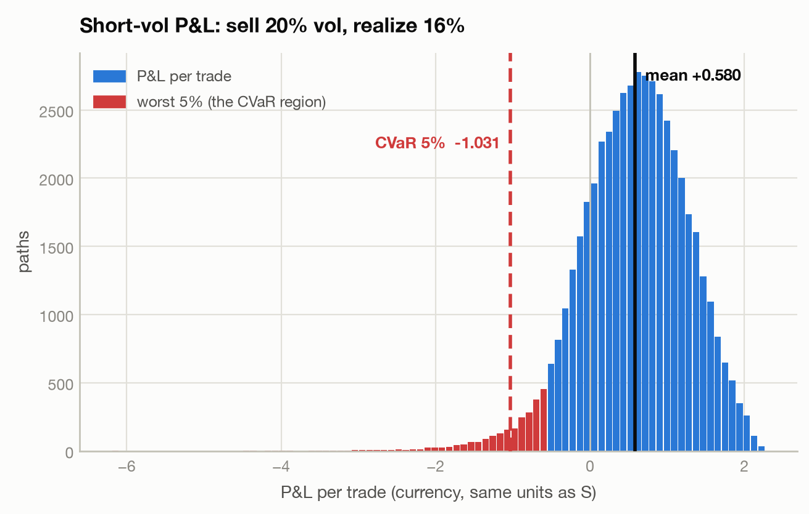
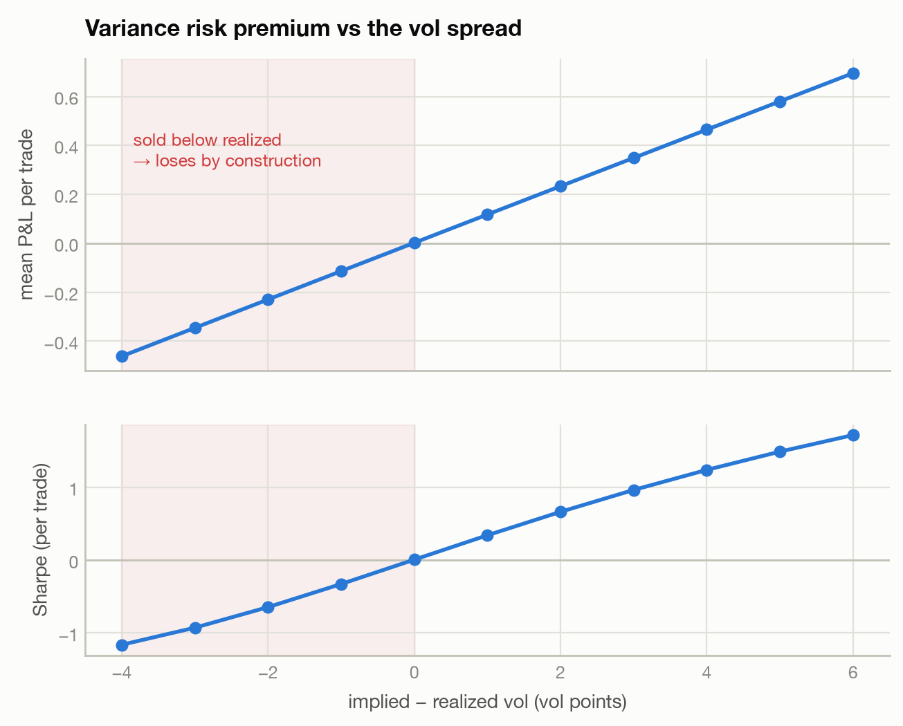
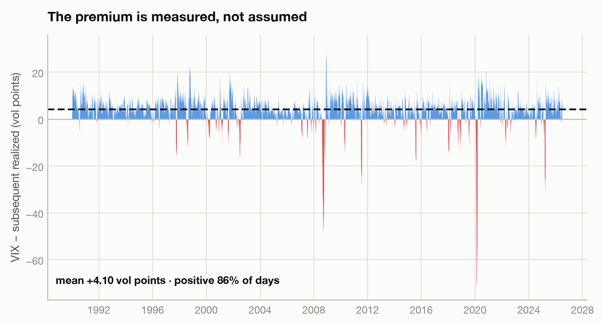
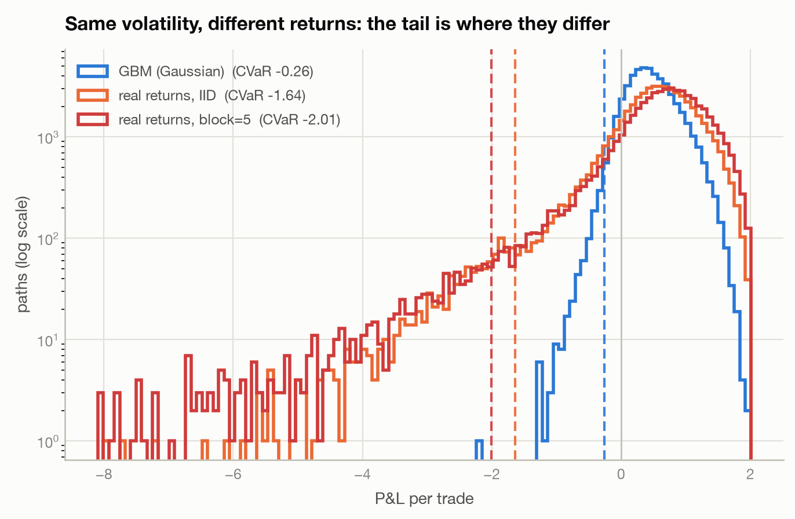
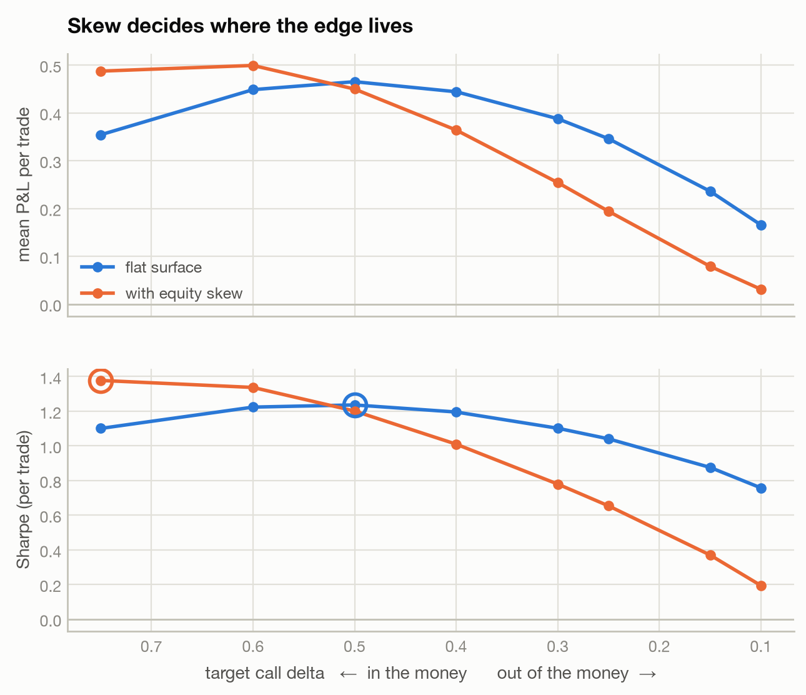
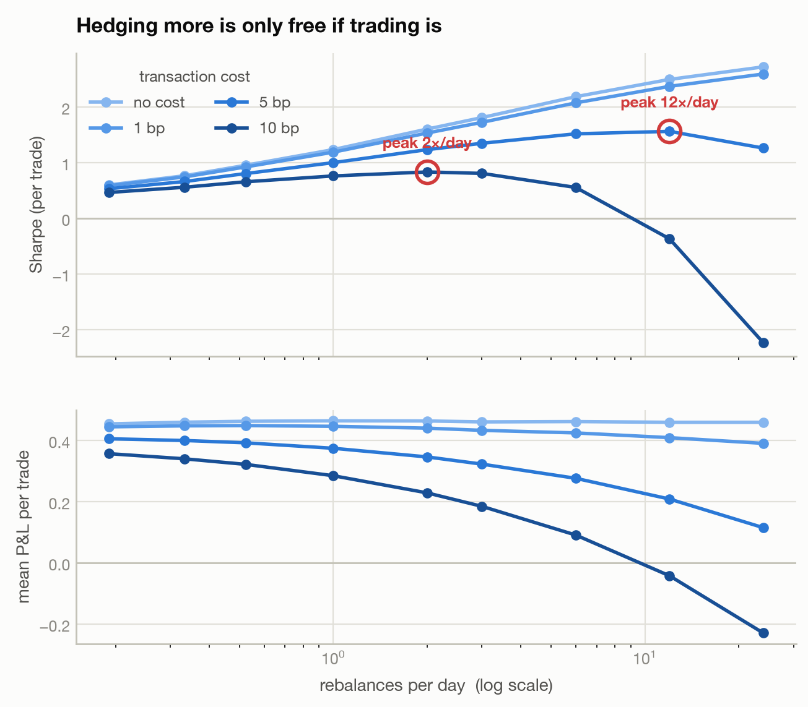
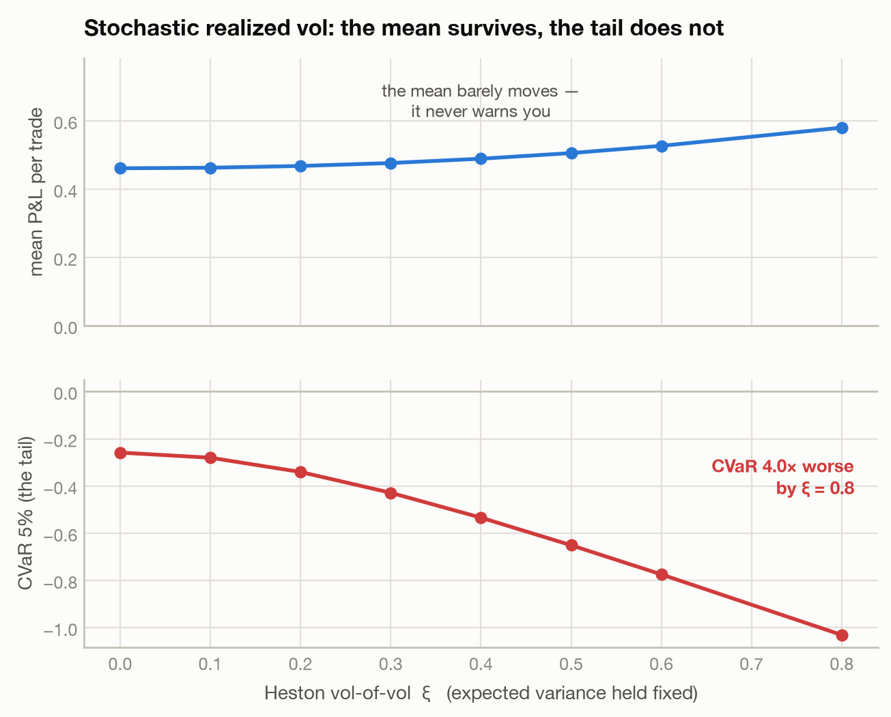

# vrp-short-vol

[](https://github.com/MaxChiu1122/vrp-short-vol/actions/workflows/ci.yml)

A **systematic short-volatility strategy**, backtested as a Monte-Carlo *distribution*
rather than a single historical path. Built on the
[`mcpricer`](https://github.com/MaxChiu1122/Monte-Carlo_option_pricer) C++ pricing/Greeks
engine — this repo is the strategy/research layer that consumes it.

> **66 pytest tests green**, run on every push against the engine rebuilt from source. On a
> 4-vol-point spread the strategy shows Sharpe 1.23 with a losing 5% tail — and that tail gets
> 4× worse under stochastic vol, and 6–8× worse on real return shapes. The premium itself is
> measured, not assumed: **+4.10 vol points**, positive on 85.8% of days since 1990.

## The idea

Sell a European call and delta-hedge it to expiry. You **sell and hedge at the implied
vol** (the premium you collect and every delta you trade use `sigma_implied`), but the
underlying **realizes** a different vol, `sigma_realized`. A delta-hedged short call's
P&L is the *gamma-weighted vol spread*:

```
P&L  ≈  ½ · Σ_t  S_t² · Γ_t · (σ_implied² − σ_realized²) · dt
```

When `σ_implied > σ_realized` — the empirical norm, since implied vol carries a risk
premium — the strategy earns the **variance risk premium (VRP)**. Because the book is
**short gamma**, a realized-vol spike (a crash) produces a sharp loss: the P&L is
left-skewed, and the tail is what actually matters.

[`notebooks/01-anatomy-of-a-hedge.ipynb`](notebooks/01-anatomy-of-a-hedge.ipynb) opens up a single
path — the spot, the delta, the cash, the P&L accruing step by step — and verifies that identity
numerically, showing the gap between it and the realized P&L shrink like `1/√n` as the hedge
refines. That is the sharpest evidence in the repo that the engine computes what the theory says.

## Why a *distributional* backtest

A single historical path tells you what happened once. Because `mcpricer` is fast and
reproducible, we instead simulate the strategy over **many thousands of market paths**
and report the full P&L distribution:

- **mean P&L** — the harvested VRP (the edge),
- **Sharpe** — edge per unit of P&L dispersion,
- **CVaR (5%)** — the mean of the worst 5% of outcomes: the short-gamma tail,
- and the **VRP curve** — mean P&L as a function of the (implied − realized) vol spread.

A *stress* mode simulates realized vol under **Heston** (stochastic vol / vol-of-vol,
via `mcpricer`) to show the left tail fatten even when the mean stays positive — the
"what kills you" story.

## Results

The contract: a 1-month ATM European call (`S = K = 100`, `r = 2%`), delta-hedged over 21
daily steps, **sold at 20% implied into a world that realizes 16%** — a 4-vol-point spread.
50,000 paths, seed 11.

| metric | value |
|---|---|
| mean P&L per trade | **+0.4626** |
| Sharpe (per trade) | **1.23** |
| win rate | **90.8%** |
| CVaR (5%) | **−0.2610** |

<picture>
  <source media="(prefers-color-scheme: dark)" srcset="docs/pnl_distribution_dark.png">
  
</picture>

That shape *is* the strategy: it wins 91% of the time and still carries a losing 5% tail.
The shaded bars are the outcomes CVaR averages over — the tail is drawn as an area because
CVaR is the mean of one, not a threshold. Many small wins, occasional real damage, which is
what being **short gamma** buys you.

<picture>
  <source media="(prefers-color-scheme: dark)" srcset="docs/vrp_curve_dark.png">
  
</picture>

The edge is linear in the vol spread and crosses zero exactly where implied meets realized —
sell vol below what the world delivers and the same machinery bleeds. Mean P&L and Sharpe sit
in separate panels rather than on twin axes, since their units are unrelated.

**A check on the core worth more than the plots.** The curve's slope is `0.1156` per vol
point; Black-Scholes vega on this contract is `0.1150`. They agree to 0.5%, because for small
spreads `mean P&L ≈ vega · (σ_implied − σ_realized)`. That pins the P&L engine's *magnitude*
against a closed-form Greek — evidence independent of the test suite, which only checks signs
and distribution shape.

Both figures regenerate from a seeded run:

```bash
python scripts/make_figures.py
```

Everything to this point takes `sigma_realized` as an input, which is the right way to study the
mechanics but leaves the premium assumed. The next two sections stop assuming it.

## Does the premium actually exist?

VIX is the market's 30-day implied vol on the S&P 500. The realized vol of the *following* month is
what actually happened. Their difference is the variance risk premium, observed rather than posited
— 9,189 overlapping daily observations, 1990 to today, from the vendored
`data/spx_vix_daily.csv`.

<picture>
  <source media="(prefers-color-scheme: dark)" srcset="docs/vrp_history_dark.png">
  
</picture>

| period | mean spread | positive |
|---|---|---|
| 1990–2000 | +5.44 vp | 92.4% |
| 2000–2010 | +3.35 vp | 81.5% |
| 2010–2020 | +3.68 vp | 84.3% |
| 2020–2026 | +3.80 vp | 84.5% |
| **full sample** | **+4.10 vp** | **85.8%** |

**Yes — and the 4-vol-point spread this repo assumes is almost exactly the historical mean.** That
was a guess when the contract was written; it turns out to be +4.10.

The red spikes are the whole risk in one picture. The worst days to have sold vol are all mid-February
2020: VIX was 14–15, and the following month realized **87%** — a −72 vol-point spread. No amount of
being right for thirty years covers that month if you are sized wrong.

Note these are **overlapping** windows, so the observations are far from independent — good for
seeing the shape and the episodes, not a basis for a t-statistic.

## Does it matter that returns aren't Gaussian?

The GBM backtest assumes independent normal returns. Real equity returns are neither:

| | S&P 500 daily | Gaussian |
|---|---|---|
| excess kurtosis | **10.86** | 0 |
| autocorrelation of \|return\|, lag 1 | **0.274** | 0 |

So `bootstrap_pnl_paths` resamples the actual daily history instead of drawing normals — `block=1`
for an IID bootstrap (fat tails, no clustering), `block=k` for a moving-block bootstrap (runs of `k`
consecutive real days, so clustering survives). Sampled returns are standardized on the
**historical population** moments and rescaled to the same `sigma_realized`, so the vol *level* is
held fixed and only the *shape* changes. Standardizing per path would force every path to the same
realized vol and destroy the very thing being measured.

<picture>
  <source media="(prefers-color-scheme: dark)" srcset="docs/return_shape_dark.png">
  
</picture>

| returns | mean | Sharpe | CVaR 5% | win rate |
|---|---|---|---|---|
| GBM (Gaussian) | +0.4626 | **1.227** | **−0.2610** | 90.8% |
| real, IID bootstrap | +0.4962 | 0.682 | **−1.6369** | 83.4% |
| real, block = 5 | +0.5847 | 0.682 | **−2.0099** | 85.5% |

**At identical volatility, the tail is 6–8× worse and the Sharpe roughly halves.** The Gaussian
run's worst month is about −2; on real return shapes it is −8 to −12, several times the annual
premium. Clustering adds materially on top of fat tails alone (−1.64 → −2.01), which is the case for
using a block bootstrap rather than an IID one.

Once again **the mean does not warn you** — it drifts *up* (+0.46 → +0.58) while the tail collapses.
That is the third time the same pattern appears in this repo, alongside the Heston stress and the
skew result, and it is the argument for CVaR in one sentence.

> Still assumed, even here: the *level* of realized vol is imposed rather than sampled jointly with
> the option's implied vol, and the resampling breaks the real dependence between vol regimes and
> the premium available. A full answer needs an option-chain history — OptionMetrics, CBOE DataShop
> or ORATS — and a genuine monthly roll rather than a bootstrap.

## Which strike to sell

Desks quote options by **delta**, not strike — a "25-delta call" is a fixed point on the surface,
while a fixed strike drifts as spot moves. So the ladder is swept by target delta, solving
`K = S·exp(−N⁻¹(Δ)·σ√T + (r + σ²/2)T)` for each rung.

<picture>
  <source media="(prefers-color-scheme: dark)" srcset="docs/moneyness_dark.png">
  
</picture>

**On a flat surface the edge peaks at the money** — dollar gamma `½S²Γ` and vega both do, and the
harvested spread follows them. A 10-delta call earns +0.166 against the ATM's +0.465.

But a flat surface is a fiction, and correcting it changes the conclusion. Real equity index calls
above the money are quoted *below* the ATM vol. Applying a linear skew in log-moneyness
(`σ(K) = σ_atm + slope·ln(K/S)`, slope −0.4 — illustrative, roughly −2 vol points at a 25-delta call):

| target Δ | strike | σ flat | σ skewed | mean (flat) | mean (skewed) | Sharpe (skewed) |
|---|---|---|---|---|---|---|
| 0.75 | 96.50 | 0.200 | 0.214 | +0.354 | **+0.487** | **1.377** |
| 0.50 | 100.33 | 0.200 | 0.199 | +0.465 | +0.450 | 1.201 |
| 0.25 | 104.32 | 0.200 | 0.183 | +0.346 | +0.194 | 0.653 |
| 0.10 | 108.04 | 0.200 | 0.169 | +0.166 | **+0.031** | 0.194 |

**The skew moves the best strike in the money.** Selling a 25-delta call loses 44% of its edge once
the surface is priced properly (+0.346 → +0.194), and a 10-delta call keeps almost nothing — you are
selling a vol spread the surface already took away from you. Its CVaR gets *worse* at the same time
(−0.225 → −0.411), because a thinner premium cushions the same bad path less well. Both directions
move against you.

Meanwhile the low-strike end improves, since the skew quotes those *above* the ATM vol. That is a
sanity check on the whole exercise rather than a surprise: by put–call parity selling a low-strike
call is selling the downside wing, which is exactly where real short-vol programmes sell. The model
reproduces the practice.

> The skew here is a **two-parameter caricature**, not a calibrated surface — one linear slope in
> log-moneyness, applied to a flat-vol hedging model. It is enough to show the *direction and rough
> size* of the effect, which is the point; a real answer needs a fitted surface and deltas computed
> against it.

## What it costs to run

Everything above is **gross**. Delta-hedging means trading the underlying 21 times a month, and
every one of those trades crosses a spread. `cost_bps` charges a proportional cost on the notional
traded, on the initial hedge and every rebalance (expiry is assumed to settle, not trade out).

That turns rebalancing frequency from a free parameter into a real decision, because the two sides
scale differently:

- **Hedging risk falls like `1/√n`.** With continuous hedging a positive vol spread wins on *every*
  path, so all of the dispersion — and the entire left tail — is discretization error.
- **Turnover grows like `√n`.** Each rebalance trades `~ Γ·S·σ·√dt` shares, so `n` of them turn
  over `√n` of notional.

<picture>
  <source media="(prefers-color-scheme: dark)" srcset="docs/hedge_frequency_dark.png">
  
</picture>

| cost | Sharpe @ daily | mean @ daily | best frequency | Sharpe there |
|---|---|---|---|---|
| none | 1.238 | +0.4646 | (no optimum) | rises to 2.73 |
| 1 bp | 1.192 | +0.4466 | (no optimum) | rises to 2.60 |
| 5 bp | 1.003 | +0.3749 | **12×/day** | 1.566 |
| 10 bp | 0.765 | +0.2853 | **2×/day** | 0.836 |

**At zero cost, hedge as often as you can — the curve never turns.** Add cost and each curve peaks,
and the peak moves *left* as cost rises. Past it you pay away more in spread than you remove in
gamma risk: at 10 bp and 24 rebalances a day the strategy loses money outright (−0.23 a trade,
Sharpe −2.2). The exponent is asserted in the tests — cost drag scales as `√n` to within 20% once
the fixed initial-hedge cost is removed.

Practically: **the underlying decides the strategy.** At index-futures costs (~1 bp) the edge is
essentially intact and frequency barely matters. At single-name costs (5–10 bp) there is a sharp
optimum, and 5 bp already eats ~20% of the edge at daily hedging.

> On annualizing: the Sharpes here are **per trade** on a 1-month contract, so ×√12 to annualize —
> the gross 1.24 becomes ~4.3, which no real short-vol book earns. That gap is the honest measure of
> what this model still omits: no bid-ask on the *option* itself, no skew, no margin or financing,
> and a realized vol that is assumed rather than measured. Costs on the hedge are one line item,
> not all of them.

Costs run on the `"python"` backend only. Asking the C++ path for them raises rather than silently
handing back a gross number.

```python
from vrp import vrp_backtest, hedge_frequency_sweep
vrp_backtest(sigma_implied=0.20, sigma_realized=0.16, cost_bps=5.0)
hedge_frequency_sweep(n_steps_grid=(21, 42, 84), cost_bps_grid=(0.0, 5.0))
```

## The stress: what actually kills the book

Constant realized vol is a convenient fiction. Real vol clusters, spikes, and spikes *while the
market falls*. So the stress keeps the **hedger unchanged** — still quoting and hedging off flat
Black-Scholes at 20%, because a quote is all a desk observes — and replaces the underlying's
dynamics with **Heston**:

```
dS_t = r S_t dt + √v_t S_t dW¹
dv_t = κ(θ − v_t) dt + ξ √v_t dW²,     corr(dW¹, dW²) = ρ
```

The calibration is the point: `v0 = θ = σ_realized²`, so the **expected variance is identical to
the GBM run**. Only the *violence* of the vol changes. Anything that moves is attributable to
vol-of-vol `ξ` and the leverage correlation `ρ = −0.7`, not to selling a different amount of vol.

<picture>
  <source media="(prefers-color-scheme: dark)" srcset="docs/heston_stress_dark.png">
  
</picture>

| ξ (vol-of-vol) | mean P&L | CVaR 5% | Sharpe | win rate | Feller |
|---|---|---|---|---|---|
| 0.0 | +0.4615 | −0.2582 | 1.222 | 90.7% | ok |
| 0.2 | +0.4682 | −0.3403 | 1.158 | 89.4% | ok |
| 0.4 | +0.4894 | −0.5337 | 1.028 | 86.4% | violated |
| 0.6 | +0.5272 | −0.7741 | 0.916 | 83.5% | violated |
| 0.8 | +0.5804 | −1.0306 | 0.844 | 81.3% | violated |

**The mean never warns you.** It doesn't fall — it *rises*, from +0.46 to +0.58. Meanwhile CVaR
degrades **4×** and Sharpe drops from 1.22 to 0.84. A desk monitoring average P&L would see a
strategy getting better right up until the tail arrived. That asymmetry is the entire argument for
reporting expected shortfall next to the mean, and it is why this repo's summary carries both.

Two details worth noting. At ξ ≥ 0.4 the **Feller condition** `2κθ ≥ ξ²` is violated, so the
variance can reach zero — exactly the regime the engine's full-truncation Euler scheme exists to
handle, and normal for calibrated parameters. And at ξ = 0 the stress reproduces the GBM backtest
(+0.4615 vs +0.4626), which is what validates the Heston path against the one we already trust.

## Performance

The per-path core lives in `mcpricer`'s multithreaded C++ engine; the Python implementation stays
as the readable reference and the default. Both are the same experiment.

```bash
python scripts/benchmark_backends.py
```

| paths | python | fast (C++) | speedup | paths/s |
|---|---|---|---|---|
| 10,000 | 0.139 s | 0.0019 s | **72×** | 5.2M |
| 50,000 | 0.701 s | 0.0094 s | **75×** | 5.3M |
| 200,000 | 2.813 s | 0.0373 s | **75×** | 5.4M |

At 200k paths the two agree distributionally — mean +0.4618 vs +0.4603 (1.29 combined s.e.),
Sharpe 1.230 vs 1.227, CVaR 5% −0.2548 vs −0.2549. They can't agree path-for-path: the backends
draw from different generators (NumPy's PCG64 vs the engine's counter-based streams), so the tests
compare them statistically. The C++ arrays are reproducible and **independent of thread count** —
fixed chunking with a per-chunk RNG stream, asserted element-wise.

```python
from vrp import vrp_backtest
vrp_backtest(sigma_implied=0.20, sigma_realized=0.16, n_paths=1_000_000, backend="fast")
```

## Install (local co-development)

`mcpricer` is a sibling repo; install it editable first, then this package:

```bash
python3 -m venv .venv
.venv/bin/pip install -e ../mcpricer        # the engine (builds the C++ extension)
.venv/bin/pip install numpy pytest
.venv/bin/pip install -e . --no-deps        # this package
.venv/bin/pytest -q
```

Regenerating the figures additionally needs matplotlib — `pip install -e ".[plot]"`.

(An external clone can instead resolve `mcpricer` from its git URL — see `pyproject.toml`.)

## Layout

```
src/vrp/
  hedge.py       # hedged_short_option_pnl — the VRP core (one path's P&L)   [Max]
  backtest.py    # vrp_pnl_paths / vrp_backtest / vrp_curve — MC harness     [harness]
  stress.py      # HestonParams / heston_pnl_paths — the stochastic-vol stress
  moneyness.py   # strike_for_delta / moneyness_sweep — the strike ladder + skew
  marketdata.py  # load_market_data / measure_vrp — the premium, measured from VIX
  bootstrap.py   # resample real S&P returns (IID / moving block) into the hedge
  stats.py       # summarize_pnl — mean / Sharpe / CVaR / win-rate           [harness]
  plot.py        # P&L histogram, VRP curve, stress curve (optional: .[plot])
scripts/         # make_figures.py, benchmark_backends.py, fetch_market_data.py
data/            # vendored daily SPX + VIX closes (committed: reproducibility)
docs/            # the README figures (light + dark)
tests/           # pytest
notebooks/       # 01-anatomy-of-a-hedge.ipynb — one path, opened up
```

## Limitations, and what would come next

Three places this is deliberately a model rather than a measurement, each flagged where it
appears above:

- **The option is priced off a flat vol.** The skew section shows the direction and rough size of
  the error with a two-parameter caricature, not a calibrated surface.
- **Costs cover the hedge only** — no bid-ask on the option itself, no margin or financing.
- **The realized-vol *level* is imposed**, even in the bootstrap. Returns are resampled for their
  shape, then rescaled to a chosen vol; they are not drawn jointly with the implied vol that was
  quoted at the time.

The next real step is a **genuine monthly roll on an option-chain history** — OptionMetrics,
CBOE DataShop or ORATS — which replaces all three at once with what was actually quoted and
actually tradeable.
